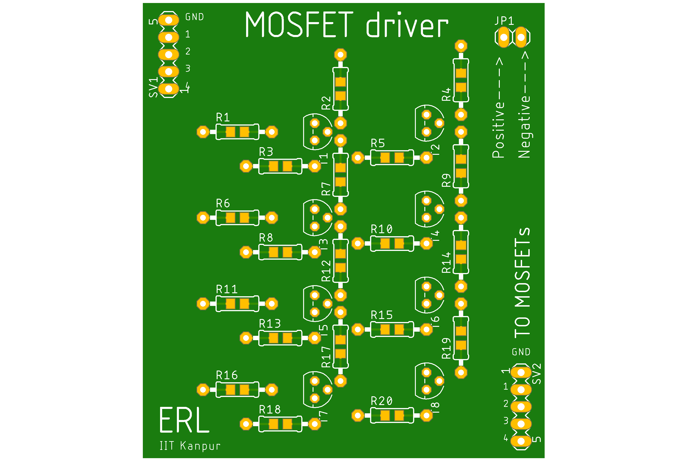
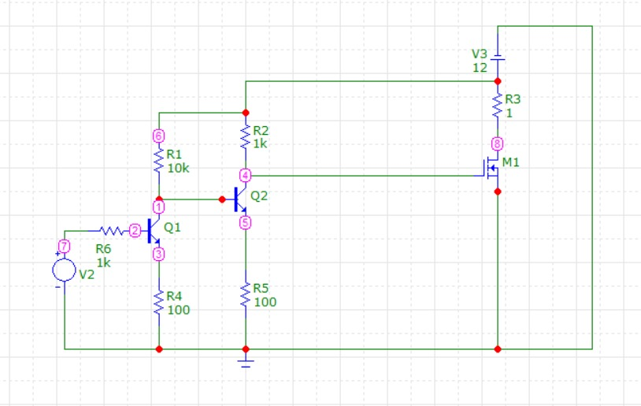
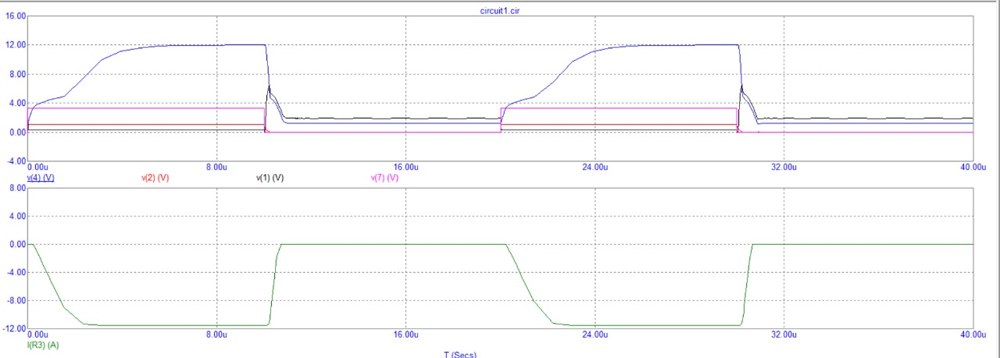
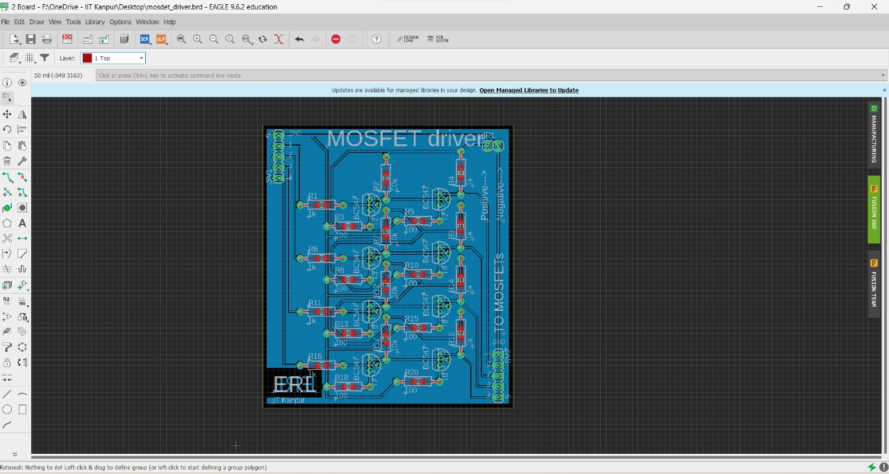
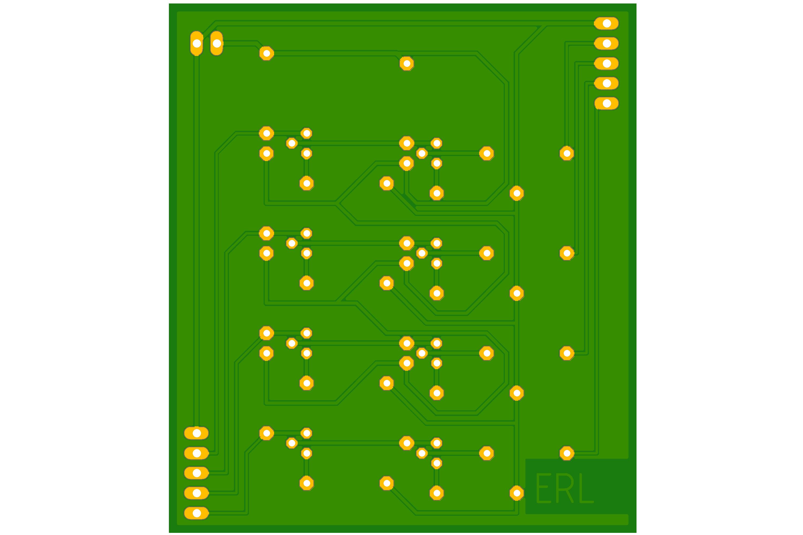

# 4 MOSFET Driver Project

Designing a MOSFET driver using Autodesk Eagle involves the creation of a schematic representation of the circuit, incorporating components such as MOSFETs, gate driver ICs, resistors, and capacitors. After configuring custom symbols and footprints if necessary, components are placed on a PCB layout, and traces are routed to connect them, ensuring adherence to design rules. Electrical Rule Checks (ERC) and Design Rule Checks (DRC) validate the schematic and layout for errors and manufacturability. Finally, Gerber files are generated for manufacturing, and if needed, simulations are conducted for performance verification, ultimately leading to the production of design documentation including a BOM and assembly drawings to facilitate manufacturing and assembly processes.

## Table of Contents

- [Introduction](#introduction)
- [Simulation results](#simulation)
- [Hardware Design](#hardware-design)
- [License](#license)

## Introduction

A MOSFET (Metal-Oxide-Semiconductor Field-Effect Transistor) is a type of semiconductor device commonly used as a switch or amplifier in electronic circuits. It consists of three terminals: gate, drain, and source. The challenge with controlling a MOSFET using 5V logic lies in its voltage threshold characteristics. MOSFETs typically require a gate-source voltage (Vgs) above a certain threshold to turn fully on. When using a 5V logic signal, it may not provide sufficient Vgs to fully saturate the MOSFET, resulting in inefficient operation or excessive power dissipation. To address this, level-shifting circuits or specialized gate drivers are often required to provide the necessary voltage levels, making MOSFET control more challenging and necessitating additional components in the circuit design.

## Simulation results

For making the MOSFET driver, analysis was carried out using Microcap using standard available resistances and BC547 n-p-n transistor and the simulation results were as follows :

  
  

## Hardware Design

After analysing the result a circuit was designed to control 4 MOSFETs by a control logic of 1V or less, Autodesk EAGLE was used to design the PCB layout

Final Board design :

